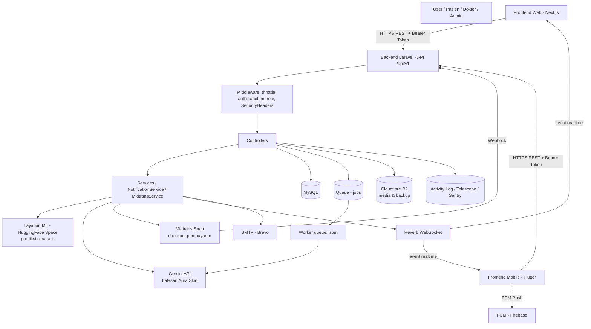
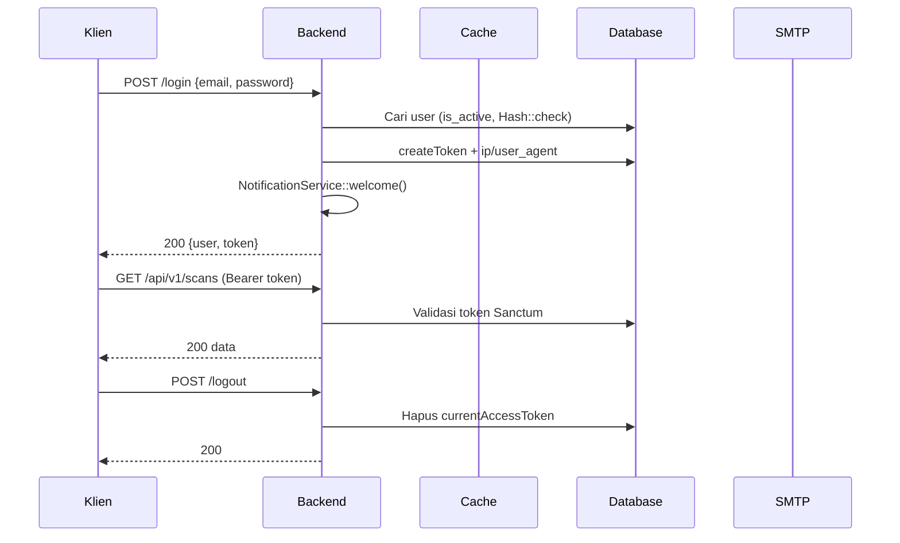
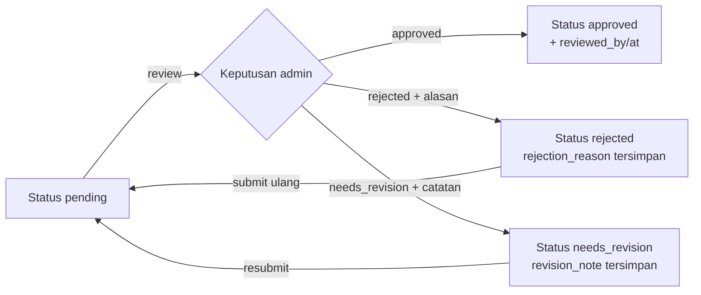
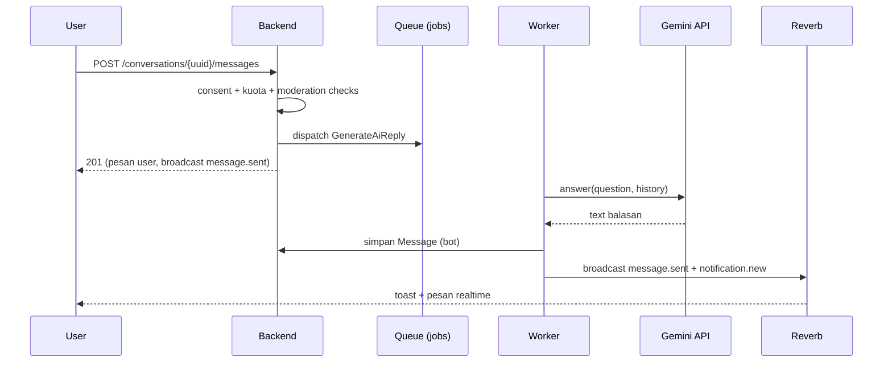

# 3. Implementasi Sistem

> Dokumen ini menjelaskan implementasi sistem SkinCek berdasarkan analisis source code repositori `be-skincek` (backend). Seluruh endpoint, tabel, field, layanan eksternal, dan mekanisme yang dijelaskan bersumber dari codebase aktual; aspek yang tidak ditemukan dinyatakan secara eksplisit.

---

# 3.1 Arsitektur Sistem

## 3.1.1 Komponen Arsitektur

SkinCek diimplementasikan sebagai **arsitektur client–server terpisah** (decoupled): backend berupa REST API stateless, frontend berupa aplikasi terpisah (web Next.js dan mobile Flutter) yang berkomunikasi melalui HTTP dan WebSocket.

| Komponen | Teknologi | Fungsi | Interaksi |
|---|---|---|---|
| Backend (API) | Laravel 13 (PHP ^8.3) | Menyediakan REST API `(/api/v1)`, business logic, validasi, otorisasi | Menerima request frontend; mengakses database, queue, storage, layanan eksternal |
| Frontend Web | Next.js (terpisah dari repositori ini) | Antarmuka pengguna web | Mengonsumsi REST API + WebSocket Reverb |
| Frontend Mobile | Flutter (terpisah dari repositori ini) | Antarmuka pengguna mobile, menerima push notification | Mengonsumsi REST API + WebSocket; menerima FCM |
| Database | MySQL (koneksi utama; SQLite untuk pengujian otomatis) | Persistensi seluruh data transaksional | Diakses via Eloquent ORM |
| Autentikasi | Laravel Sanctum 4 (bearer token) + Spatie Permission 8 (RBAC) | Autentikasi stateless dan otorisasi berbasis role | Middleware `auth:sanctum` + alias middleware `role` Spatie |
| Layanan ML | HuggingFace Space eksternal (`face-skin-predict`) — dikonsumsi via `HttpSkinPredictionService` | Prediksi kondisi kulit dari citra wajah | Backend → HTTP POST multipart ke `/predict` atau `/predict-crop` |
| Layanan AI Chat | Google Gemini API (`generativelanguage.googleapis.com`, model default `gemini-3.5-flash`) — dikonsumsi via `AiChatService`/`GeminiAiProvider` | Asisten chat "Aura Skin" | Backend → HTTP POST dengan header `x-goog-api-key` |
| Layanan Pembayaran | Midtrans Snap PHP SDK (`midtrans/midtrans-php ^2.6`) | Checkout langganan Pro (Rp15.000/bulan) dan webhook status pembayaran | Frontend → Snap redirect URL; Midtrans → webhook `POST /v1/webhooks/midtrans` |
| Push Notification | Firebase Cloud Messaging (HTTP v1) via `FcmPushNotificationService` | Push notification ke device mobile (opt-in, default nonaktif) | Backend → FCM dengan OAuth2 service account |
| Geolokasi IP | ip-api.com via `IpApiLocationResolver` | Resolusi lokasi sesi login (kota/region/negara) | Backend → HTTP GET dengan cache + rate limit |
| Email | SMTP (Brevo pada lingkungan pengembangan), 6 Mailable | Email OTP, hasil scan, status pembayaran, notifikasi pesan | Backend → SMTP; 4 mailable antrean (queued), 2 sinkron |
| Realtime | Laravel Reverb 1.x (WebSocket) | Broadcast event chat, notifikasi, status verifikasi | Backend → Reverb; Frontend → WebSocket subscribe private channel |
| Queue | Database driver (`jobs` table), 1 job `GenerateAiReply` | Pemrosesan asinkon balasan AI | Web request → job → worker `queue:listen` → Gemini API |
| Storage | Spatie Media Library 11; disk `local`/`public` dan Cloudflare R2 (disk `r2`, `backups`) | Penyimpanan foto scan, avatar, media chat, dokumen verifikasi, backup, ekspor data | MediaHelper menghasilkan URL penuh (local) atau signed URL 60 menit (R2) |
| Logging & Monitoring | Spatie Activitylog 5, Laravel Telescope 5, Sentry (`sentry/sentry-laravel ^4.27`) | Audit trail aktivitas admin, observability, error tracking | Middleware/controller menulis log; Telescope hanya aktif pada environment tertentu |
| Scheduler | Laravel Scheduler (`routes/console.php`) | 5 perintah harian (backup, prune user, purge foto, expire langganan, bersihkan notifikasi) | Cron/schedule:work memicu perintah Artisan |

**Catatan:** Source code frontend (Next.js/Flutter) tidak berada dalam repositori yang dianalisis; keberadaannya disimpulkan dari pola komunikasi API (bearer token, endpoint broadcasting, device token FCM) yang dirancang untuk klien terpisah.

## 3.1.2 Alur Arsitektur



Alur komunikasi utama:

1. Klien mengirim request REST ke `/api/v1/*` dengan header `Authorization: Bearer {token}`.
2. Middleware melakukan rate limiting (`throttle:api` 60/menit default), autentikasi Sanctum, otorisasi role (Spatie), dan injeksi security headers.
3. Controller memvalidasi input, menjalankan business logic (dibantu service), lalu membaca/menulis ke database.
4. Proses berat (balasan AI) didorong ke queue database dan diproses worker terpisah.
5. Event domain (pesan chat, notifikasi, hasil review verifikasi) di-broadcast ke Reverb dan diterima frontend secara realtime melalui WebSocket.
6. Layanan eksternal (ML, Gemini, Midtrans, FCM, ip-api) dipanggil dari service layer; Midtrans memanggil balik (webhook) untuk konfirmasi pembayaran.

## 3.1.3 Integrasi API

**Base URL:** seluruh endpoint API berada di prefix `/api/v1` (didefinisikan `routes/api.php`). Lingkungan pengembangan lokal menggunakan `http://be-skincek.test` (Laravel Herd).

**Autentikasi:** token pribadi Sanctum (Personal Access Token). Token dibuat melalui `User::createToken('auth_token')`, disimpan pada tabel `personal_access_tokens` dengan kolom tambahan `uuid`, `ip_address`, `user_agent`. Token tidak memiliki masa kedaluwarsa global (`expiration => null`); pencabutan dilakukan per-token (logout) atau seluruh token (logout all / reset password). Endpoint broadcasting auth didaftarkan `BroadcastServiceProvider` pada `POST|GET /api/v1/broadcasting/auth` dengan middleware `auth:sanctum`.

**Header yang digunakan:**
- `Authorization: Bearer {token}` — autentikasi semua endpoint protected.
- `Content-Type: application/json` — body request JSON.
- `Content-Type: multipart/form-data` — endpoint dengan upload file (register dokter, scan, chat media, avatar, verifikasi).
- `X-Signature-Key` — signature webhook Midtrans (atau field `signature_key` pada body).

**Format request:** JSON untuk operasi umum; multipart untuk unggahan berkas. Identifikasi resource publik menggunakan **UUID** (route key name model diarahkan ke kolom `uuid` melalui trait `HasPublicUuid`), bukan primary key internal.

**Format response:** seluruh response selalu dirender sebagai JSON (`shouldRenderJsonWhen(fn () => true)` pada `bootstrap/app.php`). Bentuk sukses dibungkus `{data, meta}`; bentuk error `{message}` (dan `errors` untuk validasi). Detail format pada subbab 3.3.1.

**Error handling terpadu:**
- `AuthenticationException` dirender manual menjadi `{"message": "Unauthenticated"}` dengan status 401.
- Semua exception diteruskan ke Sentry via `Integration::handles($exceptions)`.
- Kegagalan layanan eksternal ditangani per-service: ML retry 2x lalu exception dipetakan (502 / status dari upstream), Gemini ditangkap dengan fallback reply, FCM ditangkap dengan `Log::warning`, ip-api ditangkap dengan nilai `null`.

**Keamanan transport:** `SecurityHeadersMiddleware` (diprepended ke grup `api`) menetapkan `X-Content-Type-Options: nosniff`, `X-Frame-Options: DENY`, `Referrer-Policy: no-referrer`, `Permissions-Policy: camera=(), microphone=(), geolocation=()`, serta `Strict-Transport-Security` pada request aman.

---

# 3.2 Desain Data

## 3.2.1 ERD

Diagram berikut disusun dari definisi migration dan relasi Eloquent yang ditemukan. Kolom yang ditampilkan hanya kunci utama/asing dan atribut pembeda untuk keterbacaan.

```mermaid
erDiagram
    users ||--o{ personal_access_tokens : "login sesi"
    users ||--o{ device_tokens : "push device"
    users ||--o{ ai_chat_consents : "consent AI v1"
    users ||--o| doctor_verifications : "verifikasi dokter (1:1)"
    users ||--o{ subscriptions : "langganan"
    users ||--o{ prediction_histories : "riwayat scan"
    users ||--o{ prediction_feedbacks : "feedback scan"
    users ||--o{ doctor_ratings : "rating diterima (doctor_id)"
    users ||--o{ notifications : "notifikasi"
    users ||--o{ conversations : "user_id"
    users ||--o{ conversations : "doctor_id"
    users ||--o{ skincare_products : "buat dokter"
    users ||--o{ skin_recommendations : "buat dokter"
    doctor_verifications }o--|| users : "reviewed_by"
    skin_concerns ||--o{ skincare_products : "concern_id"
    skin_types ||--o{ skincare_products : "skin_type_id"
    skin_concerns ||--o{ skin_recommendations : "concern_id"
    skincare_products |o--o{ skin_recommendations : "product_id"
    conversations ||--o{ messages : "berisi"
    users ||--o{ messages : "sender_id"
    prediction_histories |o--o{ messages : "embedding hasil scan"
    prediction_histories ||--o{ prediction_feedbacks : "feedback"

    users {
        bigint id PK
        uuid UK
        string full_name
        string email UK
        string password "nullable"
        string google_id UK "nullable"
        string gender "nullable"
        date date_of_birth "nullable"
        boolean is_active
        boolean ai_bot
        timestamp privacy_consent_at
        timestamp deleted_at "soft delete"
    }
    doctor_verifications {
        bigint id PK
        bigint doctor_id FK,UK
        string verification_status
        bigint reviewed_by FK "nullable"
        json practice_locations
    }
    skin_concerns {
        bigint id PK
        string name UK
        string ml_label UK
    }
    skin_types {
        bigint id PK
        string name UK
    }
    skincare_products {
        bigint id PK
        bigint doctor_id FK
        bigint concern_id FK
        bigint skin_type_id FK "nullable"
    }
    skin_recommendations {
        bigint id PK
        bigint concern_id FK
        bigint product_id FK "nullable"
        bigint doctor_id FK
        string priority_level
    }
    prediction_histories {
        bigint id PK
        bigint user_id FK
        string predicted_class
        decimal confidence
        json probabilities
    }
    conversations {
        bigint id PK
        bigint user_id FK
        bigint doctor_id FK
    }
    messages {
        bigint id PK
        bigint conversation_id FK
        bigint sender_id FK
        text content "encrypted, nullable"
        bigint prediction_history_id FK "nullable"
    }
    subscriptions {
        bigint id PK
        bigint user_id FK
        string midtrans_order_id UK
        string status
    }
    notifications {
        uuid id PK
        bigint user_id FK
        string type
        string category
        timestamp read_at
    }
    prediction_feedbacks {
        bigint id PK
        bigint prediction_history_id FK
        bigint user_id FK
    }
    doctor_ratings {
        bigint id PK
        bigint user_id FK
        bigint doctor_id FK
    }
    device_tokens {
        bigint id PK
        bigint user_id FK
        string fcm_token
    }
    ai_chat_consents {
        bigint id PK
        bigint user_id FK
        string consent_version
    }
    personal_access_tokens {
        bigint id PK
        string tokenable_type
        bigint tokenable_id
        string token UK
        string ip_address
        string user_agent
    }
```

**Penjelasan relasi utama:**

- `users` — `doctor_verifications`: one-to-one (unique pada `doctor_id`); setiap dokter memiliki tepat satu pengajuan verifikasi.
- `users` — `conversations` (dua FK: `user_id` dan `doctor_id`): satu user dan satu dokter hanya memiliki satu percakapan (unique gabungan `user_id`,`doctor_id`), termasuk percakapan dengan bot AI `Aura Skin` (bot adalah user dengan `ai_bot = true`, role doctor).
- `prediction_histories` — `messages.prediction_history_id`: hasil scan dapat disematkan sebagai pesan chat tipe `scan_result`.
- `skin_concerns` — `skincare_products` / `skin_recommendations`: katalog perawatan dikelompokkan per concern (keluaran model ML). Relasi `PredictionHistory.skinConcern()` menghubungkan `predicted_class` ke `skin_concerns.ml_label` (join berbasis string, bukan foreign key).
- `users` — `notifications`: notifikasi in-app milik satu user (cascade delete), dengan tiga indeks komposit untuk akses per-user dan pembersihan berkala.
- `personal_access_tokens` bersifat polymorphic (`tokenable_type`, `tokenable_id`) dan menyimpan `uuid`, `ip_address`, `user_agent` untuk fitur riwayat login.
- `doctor_ratings` unique `(user_id, doctor_id)` — satu user hanya memberi satu rating per dokter (dapat diperbarui). `prediction_feedbacks` unique `(prediction_history_id, user_id)` — idempotent.
- Hanya tabel `users` yang menggunakan soft delete (`deleted_at`).

## 3.2.2 Tabel & Atribut Utama

Tabel-tabel inti beserta atribut penting (dari hasil pembacaan migration):

| Tabel | Atribut | Tipe Data | Constraint | Keterangan |
|---|---|---|---|---|
| users | id | BIGINT UNSIGNED | PK, auto increment | Identitas internal |
| users | uuid | UUID | UNIQUE | Identitas publik (route key) |
| users | full_name | VARCHAR(255) | NOT NULL | Nama lengkap (hasil rename dari `name`) |
| users | email | VARCHAR(255) | UNIQUE, NOT NULL | Kredensial login |
| users | password | VARCHAR(255) | NULLABLE | Null untuk akun Google-only; di-hash Bcrypt |
| users | google_id | VARCHAR(255) | UNIQUE, NULLABLE | Subject ID akun Google |
| users | date_of_birth / gender | DATE / VARCHAR(20) | NULLABLE | Syarat kelengkapan profil scan pertama |
| users | is_active | BOOLEAN | DEFAULT true | Flag suspend/aktivasi akun |
| users | ai_bot | BOOLEAN | DEFAULT false | Penanda akun bot Aura Skin |
| users | user_messages_count | INT UNSIGNED | DEFAULT 0 | Counter kuota chat gratis (limit 3) |
| users | privacy_consent_at | TIMESTAMP | NULLABLE | Bukti persetujuan UU PDP |
| users | deleted_at | TIMESTAMP | NULLABLE | Soft delete (hanya tabel ini) |
| doctor_verifications | id / uuid | BIGINT / UUID | PK / UNIQUE | |
| doctor_verifications | doctor_id | BIGINT UNSIGNED | FK → users (cascade), UNIQUE | Relasi 1:1 dengan user dokter |
| doctor_verifications | verification_status | VARCHAR(255) | DEFAULT 'pending' | Enum: pending/approved/rejected/needs_revision |
| doctor_verifications | str_number, specialization, title, sub_specialization, alma_mater | VARCHAR | spesialisasi NOT NULL | Data profesional |
| doctor_verifications | practice_locations / professional_organizations | JSON | NULLABLE | Array lokasi & organisasi |
| doctor_verifications | reviewed_by / reviewed_at | BIGINT FK (nullOnDelete) / TIMESTAMP | NULLABLE | Admin peninjau & waktu review |
| doctor_verifications | rejection_reason / revision_note | TEXT | NULLABLE | Alasan penolakan / catatan revisi |
| skin_concerns | id / uuid | BIGINT / UUID | PK / UNIQUE | |
| skin_concerns | name / ml_label | VARCHAR(255) | UNIQUE keduanya | Label bahasa Indonesia / label keluaran model ML |
| skin_concerns | default_severity_score | TINYINT UNSIGNED | NULLABLE | Bobot keparahan default |
| skin_types | name | VARCHAR(255) | UNIQUE | Berminyak/Kering/Kombinasi/Normal/Sensitif |
| skincare_products | doctor_id / concern_id | FK | cascade delete | Produk dibuat dokter, terikat concern |
| skincare_products | skin_type_id | FK | NULLABLE, nullOnDelete | Jenis kulit yang cocok |
| skincare_products | category / gender | VARCHAR(255) / VARCHAR(20) | gender DEFAULT 'unisex' | Kategori produk & segmentasi |
| skincare_products | usage_instruction | TEXT | NOT NULL | Instruksi pemakaian |
| skincare_products | is_active | BOOLEAN | DEFAULT true | Visibilitas publik |
| skin_recommendations | concern_id / doctor_id | FK | cascade delete | Tips perawatan per concern |
| skin_recommendations | product_id | FK | NULLABLE, nullOnDelete | Tips dapat (opsional) menautkan produk |
| skin_recommendations | priority_level | VARCHAR(255) | DEFAULT 'medium' | Enum low/medium/high |
| prediction_histories | user_id | FK | cascade delete | Pemilik scan |
| prediction_histories | scan_mode | VARCHAR(255) | | Enum upload/livecam |
| prediction_histories | predicted_class | VARCHAR(255) | | Label kelas ML (join ke skin_concerns.ml_label) |
| prediction_histories | confidence | DECIMAL(5,4) | | Keyakinan model 0–1 |
| prediction_histories | probabilities | JSON | | Distribusi seluruh kelas |
| prediction_histories | severity_score / severity_level | TINYINT UNSIGNED / VARCHAR | | Skor 0–100 & enum low/medium/high |
| prediction_histories | raw_response | JSON | NULLABLE | Respons mentah ML untuk audit |
| prediction_histories | created_at | TIMESTAMP | DEFAULT CURRENT_TIMESTAMP | Tanpa updated_at |
| conversations | user_id + doctor_id | FK (keduanya) | UNIQUE gabungan | Satu pasang = satu percakapan |
| messages | conversation_id / sender_id | FK | cascade delete | |
| messages | content | TEXT | NULLABLE, **encrypted cast** | Isi pesan terenkripsi at rest |
| messages | type | VARCHAR(20) | DEFAULT 'text' | text/image/video/scan_result |
| messages | prediction_history_id | FK | NULLABLE, nullOnDelete | Sematan hasil scan |
| subscriptions | user_id | FK | cascade delete | |
| subscriptions | plan_code / period | VARCHAR | period DEFAULT 'monthly' | pro_monthly / pro_lifetime |
| subscriptions | status | VARCHAR | Enum pending/active/expired/cancelled | |
| subscriptions | midtrans_order_id | VARCHAR(255) | UNIQUE, NULLABLE | Korelasi webhook pembayaran |
| subscriptions | amount / currency | INT UNSIGNED / VARCHAR | currency DEFAULT 'IDR' | 15000 IDR (Pro bulanan) |
| subscriptions | starts_at / ends_at / paid_at | TIMESTAMP | NULLABLE | Periode aktif & pembayaran |
| notifications | id | UUID | PK | PK langsung UUID |
| notifications | user_id | FK | cascade delete, index komposit (user_id, read_at) & (user_id, created_at) | Notifikasi per-user |
| notifications | type / category | VARCHAR(20) / VARCHAR(50) | Enum NotificationType / NotificationCategory | Warna toast & konteks bisnis |
| notifications | title / message / action_url | VARCHAR(255) / TEXT / VARCHAR(500) | action_url NULLABLE | Konten & deep-link |
| notifications | read_at | TIMESTAMP | NULLABLE, index created_at (idx_cleanup) | Status baca |
| doctor_ratings | user_id + doctor_id | FK (keduanya) | UNIQUE gabungan | Satu rating per user per dokter |
| doctor_ratings | rating | TINYINT UNSIGNED | 1–5 | |
| prediction_feedbacks | prediction_history_id + user_id | FK (keduanya) | UNIQUE gabungan | Feedback idempotent per scan |
| device_tokens | user_id + fcm_token | FK / VARCHAR(255) | UNIQUE gabungan | Token FCM per device |
| ai_chat_consents | user_id + consent_version | FK / VARCHAR(255) | UNIQUE gabungan | Jejak persetujuan AI (UU PDP) |
| personal_access_tokens | token | VARCHAR(64) | UNIQUE | Hash token Sanctum |
| personal_access_tokens | uuid / ip_address / user_agent | UUID UNIQUE / VARCHAR | NULLABLE | Riwayat sesi login |
| activity_log | log_name, event | VARCHAR / VARCHAR | INDEX log_name | Log Spatie (audit admin) |
| activity_log | subject / causer | nullableMorphs | INDEX | Model target & pelaku |
| telescope_entries | uuid / batch_id / type | UUID UNIQUE / UUID INDEX / VARCHAR | | Observability dev |
| roles / permissions / model_has_roles / role_has_permissions | — | — | Spatie Permission standar (teams=false) | RBAC |

Tabel pendukung lain: `password_reset_tokens` (OTP password disimpan di cache, bukan tabel ini — tabel ini disediakan bawaan broker), `sessions`, `cache`, `cache_locks`, `jobs`, `job_batches`, `failed_jobs`, `media` (Spatie), `telescope_entries_tags`, `telescope_monitoring`.

---

# 3.3 Desain API dan Integrasi

## 3.3.1 Format Response

Seluruh response dirender JSON selalu (`bootstrap/app.php`). Terdapat dua konvensi envelope:

**Response sukses** (trait `ApiResponse::successResponse`):

```json
{
  "data": { },
  "meta": { "message": "Berhasil" }
}
```

`meta` dikosongkan menjadi objek `{}` bila tidak diisi. Endpoint resource berbasis Laravel Resource Collection mengembalikan format pagination standar `{data, links, meta}` dengan `meta.current_page`, `last_page`, `per_page`, `total`.

**Response error** (trait `ApiResponse::errorResponse`):

```json
{
  "message": "Kredensial tidak valid"
}
```

**Error validasi (422)** — dibentuk otomatis Laravel:

```json
{
  "message": "The email has already been taken. (and 1 more error)",
  "errors": {
    "email": ["The email has already been taken."]
  }
}
```

**Pemetaan status code yang digunakan sistem secara konsisten:**

| Status | Kondisi | Contoh |
|---|---|---|
| 200 | Operasi baca/sukses umum | GET resource, update |
| 201 | Pembuatan resource | Register, scan, pesan, checkout, verifikasi submit |
| 401 | Token invalid / kredensial salah | `{"message": "Unauthenticated"}`, `"Kredensial tidak valid"` |
| 402 | Kuota chat gratis manusia habis | "Kamu sudah melewati 3 pesan gratis..." |
| 403 | Otorisasi / gate fitur | Role salah, email belum terverifikasi, signature webhook invalid |
| 404 | Resource tidak ditemukan / milik user lain (disembunyikan) | Detail scan user lain |
| 422 | Validasi / konflik state | Data tidak lengkap, sudah berlangganan |
| 429 | Rate limit / kuota | 60 req/menit API; 3 scan/hari; 10 pesan AI/hari |
| 502 | Upstream ML gagal | "Layanan prediksi sedang sibuk" |

**Pagination:** parameter `per_page` dibatasi whitelist `[5, 10, 20, 50]` melalui `Controller::perPage()`; nilai default **5**. Pengecualian: `NotificationController::index` menggunakan `limit` default 15 dengan cap 50.

## 3.3.2 Daftar Endpoint

Seluruh endpoint didefinisikan pada `routes/api.php` di bawah prefix `/api/v1` dengan middleware `throttle:api`.

### Autentikasi (Public)

| Method | Endpoint | Auth | Fungsi |
|---|---|---|---|
| POST | /api/v1/register | No | Registrasi user (throttle:auth 5/m) |
| POST | /api/v1/register-doctor | No | Registrasi dokter + verifikasi pending (throttle:auth) |
| POST | /api/v1/login | No | Login email/password (throttle:auth) |
| POST | /api/v1/auth/google | No | Login Google ID token (throttle:google-auth 10/m) |
| POST | /api/v1/forgot-password | No | Kirim OTP reset (throttle:forgot-password 3/15m) |
| POST | /api/v1/reset-password | No | Reset password dengan OTP (throttle:reset-password 10/m) |

### Profil & Sesi (Auth)

| Method | Endpoint | Auth | Fungsi |
|---|---|---|---|
| GET | /api/v1/profile | User | Profil (field berbeda per role) |
| PATCH | /api/v1/profile | User | Update profil & avatar (1x/24 jam) |
| DELETE | /api/v1/profile | User | Hapus akun (soft delete) |
| POST | /api/v1/profile/change-password | User | Ubah password |
| DELETE | /api/v1/profile/avatar | User | Hapus foto profil |
| POST | /api/v1/profile/export | User | Ekspor data (signed URL 30 menit) |
| GET | /api/v1/profile/exports/download | User | Unduh hasil ekspor |
| POST | /api/v1/email/verify/send | User | Kirim OTP verifikasi email |
| POST | /api/v1/email/verify | User | Verifikasi OTP |
| GET | /api/v1/login-activity | User | Daftar sesi login + lokasi |
| DELETE | /api/v1/login-activity/{tokenUuid} | User | Cabut satu sesi |
| POST | /api/v1/logout | User | Logout sesi aktif |
| POST | /api/v1/logout-all | User | Logout semua perangkat |
| GET | /api/v1/device-tokens | User | Daftar device push |
| POST | /api/v1/device-tokens | User | Registrasi FCM token |
| DELETE | /api/v1/device-tokens/{uuid} | User | Hapus device |

### Scan Kulit (User)

| Method | Endpoint | Auth | Fungsi |
|---|---|---|---|
| POST | /api/v1/scans | User | Scan upload (throttle:scans 30/m; kuota 3/hari free) |
| POST | /api/v1/scans/livecam | User | Scan livecam (crop wajah) |
| GET | /api/v1/scans | User | Riwayat scan (filter scan_mode, predicted_class) |
| GET | /api/v1/scans/{uuid} | User | Detail scan (404 bila milik orang lain) |
| POST | /api/v1/scans/{uuid}/feedback | User | Feedback akurasi (idempotent) |

### Konsultasi & AI Chat (Auth)

| Method | Endpoint | Auth | Fungsi |
|---|---|---|---|
| GET | /api/v1/doctors | User | List dokter approved (Aura Skin pinned atas) |
| GET | /api/v1/doctors/{uuid} | User | Profil publik dokter |
| POST | /api/v1/conversations | User | Mulai konsultasi dengan dokter |
| GET | /api/v1/conversations | User | Daftar percakapan + pesan terakhir |
| GET | /api/v1/conversations/{uuid}/messages | Participant | Pesan dalam percakapan |
| POST | /api/v1/conversations/{uuid}/messages | Participant | Kirim pesan/media/hasil scan |
| POST | /api/v1/doctors/{uuid}/ratings | User | Buat/update rating dokter (harus pernah chat) |
| GET | /api/v1/doctors/{uuid}/ratings | User | Review dokter |
| GET | /api/v1/ai-chat/consent | User | Status persetujuan AI |
| POST | /api/v1/ai-chat/consent | User | Set/cabut persetujuan AI |
| POST | /api/v1/ai-chat/conversations | User | Mulai chat Aura Skin (gate consent) |
| DELETE | /api/v1/ai-chat/conversations/{uuid} | User | Hapus riwayat chat Aura Skin saja |

### Langganan (User)

| Method | Endpoint | Auth | Fungsi |
|---|---|---|---|
| GET | /api/v1/subscriptions | User | Riwayat langganan |
| POST | /api/v1/subscriptions/checkout | User | Buat transaksi Midtrans Snap |
| GET | /api/v1/subscriptions/{uuid}/receipt | Owner | Bukti langganan aktif |
| POST | /api/v1/subscriptions/{uuid}/cancel | Owner | Batalkan langganan aktif |
| GET\|POST | /api/v1/webhooks/midtrans | No | Webhook pembayaran (signature sha512) |

### Katalog Perawatan (Public read / Doctor CRUD / Admin read)

| Method | Endpoint | Auth | Fungsi |
|---|---|---|---|
| GET | /api/v1/skincare-products | No | Katalog produk aktif (filter concern/skin_type/gender) |
| GET | /api/v1/skincare-products/{uuid} | No | Detail produk |
| POST | /api/v1/skincare-products | Doctor (verified) | Buat produk |
| PATCH | /api/v1/skincare-products/{uuid} | Doctor pemilik / Admin | Update produk |
| DELETE | /api/v1/skincare-products/{uuid} | Doctor pemilik / Admin | Hapus produk |
| GET | /api/v1/doctor/products | Doctor | Produk sendiri (termasuk non-aktif) |
| GET | /api/v1/admin/skincare-products | Admin | Semua produk |
| GET | /api/v1/skin-recommendations | No | Tips perawatan aktif (filter ml_label/concern_id; urut prioritas) |
| GET | /api/v1/skin-recommendations/{uuid} | No | Detail tips |
| POST | /api/v1/skin-recommendations | Doctor (verified) | Buat tips |
| PATCH | /api/v1/skin-recommendations/{uuid} | Doctor pemilik / Admin | Update tips |
| DELETE | /api/v1/skin-recommendations/{uuid} | Doctor pemilik / Admin | Hapus tips |
| GET | /api/v1/doctor/recommendations | Doctor | Tips milik sendiri |
| GET | /api/v1/skin-concerns | No | Daftar concern (admin melihat semua, lainnya hanya aktif) |
| GET | /api/v1/skin-concerns/{uuid} | No | Detail concern |
| PATCH | /api/v1/skin-concerns/{uuid} | Doctor | Update deskripsi concern saja |
| GET | /api/v1/skin-types | No | Daftar jenis kulit |
| GET | /api/v1/skin-types/{uuid} | No | Detail jenis kulit |
| POST | /api/v1/skin-types | Doctor | Buat jenis kulit |
| PATCH | /api/v1/skin-types/{uuid} | Doctor | Update jenis kulit |
| DELETE | /api/v1/skin-types/{uuid} | Doctor | Hapus jenis kulit |

### Verifikasi Dokter (Doctor submit / Admin review)

| Method | Endpoint | Auth | Fungsi |
|---|---|---|---|
| GET | /api/v1/doctor-verifications | Doctor | Status verifikasi sendiri |
| POST | /api/v1/doctor-verifications | Doctor | Submit verifikasi (baru / ulang setelah rejected) |
| POST | /api/v1/doctor-verifications/{uuid}/resubmit | Doctor | Perbaiki data (hanya needs_revision) |
| GET | /api/v1/admin/verifications | Admin | Daftar semua verifikasi (filter status) |
| GET | /api/v1/admin/verifications/{uuid} | Admin | Detail verifikasi + dokumen |
| PATCH | /api/v1/doctor-verifications/{uuid}/review | Admin | Approve / reject / needs_revision |

### Admin & Dokter Dashboard

| Method | Endpoint | Auth | Fungsi |
|---|---|---|---|
| GET | /api/v1/admin/dashboard | Admin | Statistik platform + chart 14 hari |
| GET | /api/v1/admin/profile | Admin | Profil admin + ringkasan |
| GET | /api/v1/admin/users | Admin | List user (filter role) |
| GET | /api/v1/admin/users/{uuid} | Admin | Detail user |
| PATCH | /api/v1/admin/users/{uuid}/role | Admin | Ubah role (syncRoles) |
| PATCH | /api/v1/admin/users/{uuid}/toggle-active | Admin | Suspend/aktivasi user |
| GET | /api/v1/admin/activity-log | Admin | Log aktivitas (filter log_name/causer) |
| GET | /api/v1/doctor/dashboard | Doctor | Statistik praktik dokter |

### Notifikasi (Auth) & Broadcasting

| Method | Endpoint | Auth | Fungsi |
|---|---|---|---|
| GET | /api/v1/notifications | User | List notifikasi (+unread_count, ?unread_only, ?limit) |
| GET | /api/v1/notifications/unread-count | User | Jumlah belum dibaca |
| POST | /api/v1/notifications/{id}/read | User | Tandai satu dibaca |
| POST | /api/v1/notifications/read-all | User | Tandai semua dibaca |
| DELETE | /api/v1/notifications/{id} | User | Hapus notifikasi |
| POST\|GET | /api/v1/broadcasting/auth | User | Autentikasi channel private (Echo) |
| GET | /api/v1/emergency | No | Hotline darurat |

## 3.3.3 Contoh Request

**Registrasi dokter** (`POST /api/v1/register-doctor`, multipart):

```http
POST /api/v1/register-doctor HTTP/1.1
Content-Type: multipart/form-data

full_name: dr. Sari Dewi
email: sari@skincek.com
password: password123
specialization: Dermatologi Klinik
title: dr. Sp.D
str_number: STR-123456
experience_years: 8
alma_mater: Universitas Indonesia
practice_locations[]: RS Pondok Indah
professional_organizations[]: PERDOSKI
documents[]: (binary str.pdf)
privacy_consent: true
```

**Login** (`POST /api/v1/login`):

```http
POST /api/v1/login
Content-Type: application/json

{
  "email": "user@skincek.com",
  "password": "password123"
}
```

**Scan kulit** (`POST /api/v1/scans`, multipart):

```http
POST /api/v1/scans
Authorization: Bearer 1|abcdef...
Content-Type: multipart/form-data

image: (binary face.jpg)   # jpeg/jpg/png/webp, max 5 MB
```

**Kirim pesan chat dengan sematan hasil scan** (`POST /api/v1/conversations/{uuid}/messages`):

```http
POST /api/v1/conversations/9d0f.../messages
Authorization: Bearer 1|abcdef...
Content-Type: application/json

{
  "prediction_history_id": "550e8400-e29b-41d4-a716-446655440000"
}
```

**Checkout langganan** (`POST /api/v1/subscriptions/checkout`):

```http
POST /api/v1/subscriptions/checkout
Authorization: Bearer 1|abcdef...
Content-Type: application/json

{ }
```

**Webhook Midtrans** (`POST /api/v1/webhooks/midtrans`):

```json
{
  "order_id": "SKINCEK-A1B2C3",
  "status_code": "200",
  "gross_amount": "15000.00",
  "transaction_status": "settlement",
  "payment_type": "gopay",
  "signature_key": "a1b2c3..."
}
```

## 3.3.4 Contoh Response

**Hasil scan (201)** — `PredictionHistoryResource`:

```json
{
  "data": {
    "uuid": "550e8400-e29b-41d4-a716-446655440000",
    "scan_mode": "upload",
    "predicted_class": "inflammatory acne",
    "confidence": 0.87,
    "probabilities": { "inflammatory acne": 0.87, "dark spots": 0.12 },
    "severity_score": 73,
    "severity_level": "high",
    "model_used": "skin-model-v1",
    "image_url": "https://...",
    "disclaimer": "Hasil scan hanya sebagai referensi awal dan bukan diagnosis medis...",
    "skin_concern": {
      "name": "Jerawat Meradang",
      "description": "Jerawat yang tampak merah, bengkak, dan terasa nyeri..."
    },
    "other_concerns": [
      { "ml_label": "dark spots", "name": "Flek Hitam", "description": "...", "confidence": 0.12 }
    ],
    "treatment_recommendations": [
      {
        "uuid": "rec-uuid",
        "title": "Konsultasikan Bila Peradangan Memburuk",
        "recommendation_text": "Jerawat meradang yang besar, nyeri...",
        "priority_level": "high"
      }
    ],
    "skincare_recommendations": [
      {
        "uuid": "prod-uuid",
        "name": "Cetaphil Gentle Skin Cleanser",
        "category": "cleanser",
        "gender": "unisex",
        "key_ingredients": "Water, Cetyl Alcohol, ...",
        "usage_instruction": "Basahi wajah dengan air suhu ruang...",
        "warning": "Hindari kontak langsung dengan mata...",
        "skin_type": "Sensitif",
        "doctor": "dr. Sari Dewi"
      }
    ],
    "notice": null,
    "created_at": "2026-08-30T10:00:00.000000Z"
  }
}
```

**Login sukses (200):**

```json
{
  "data": {
    "user": {
      "uuid": "ae2ba792-f1c1-4817-acdd-13a079715f37",
      "full_name": "Budi Santoso",
      "email": "user@skincek.com",
      "avatar_url": null,
      "profile_completed": true,
      "email_verified": false
    },
    "token": "63|C2FJBvDwunsvhEUJgumZG9GP0oroxVujIh2vTXc9d6feb23a"
  },
  "meta": {}
}
```

**Checkout sukses (201):**

```json
{
  "data": {
    "snap_token": "snap-token-hash",
    "redirect_url": "https://app.sandbox.midtrans.com/snap/v2/...",
    "subscription": {
      "uuid": "sub-uuid",
      "plan_code": "pro_monthly",
      "period": "monthly",
      "status": "pending",
      "amount": 15000,
      "currency": "IDR",
      "midtrans_order_id": "SKINCEK-A1B2C3"
    }
  },
  "meta": { "message": "Transaksi pembayaran berhasil dibuat" }
}
```

**Daftar dokter (200)** — `DoctorResource::collection` (Aura Skin selalu di atas via `orderByRaw('ai_bot DESC')`):

```json
{
  "data": [
    {
      "uuid": "aura-bot-uuid",
      "full_name": "Aura Skin",
      "title": null,
      "specialization": "Asisten Kecerdasan Buatan SkinCek",
      "avatar": null,
      "rating_avg": null,
      "rating_count": 0,
      "is_ai_bot": true
    }
  ],
  "meta": { "current_page": 1, "per_page": 5, "total": 2, "last_page": 1 }
}
```

---

# 3.4 Implementasi Modul

## 3.4.1 Autentikasi & Otorisasi

**Mekanisme token.** Autentikasi menggunakan Laravel Sanctum bearer token stateless. Setiap login/register memanggil `createSessionToken()` yang membuat token bernama `auth_token` lalu `forceFill` kolom `ip_address` dan `user_agent` pada record token — data ini yang menyalurkan fitur riwayat login. Model `PersonalAccessToken` kustom menambahkan UUID otomatis pada event `creating` sehingga pencabutan sesi dapat dirujuk lewat UUID.

**Registrasi.** Dua jalur registrasi: `register` (user biasa) dan `register-doctor` (membuat user role doctor + `DoctorVerification` status `pending` + unggah dokumen dalam satu DB transaction). Validasi email menggunakan `Rule::unique('users')->whereNull('deleted_at')` sehingga akun soft-deleted tidak menghalangi pendaftaran ulang. `privacy_consent` wajib diterima (tercatat `privacy_consent_at`).

**Password hashing.** Seluruh password di-hash `Hash::make()` (Bcrypt, `BCRYPT_ROUNDS=12`). Kolom `users.password` nullable untuk mendukung akun Google-only.

**Login Google.** `GoogleTokenVerifier` memverifikasi `id_token` via `Google\Client`, membandingkan `aud` terhadap daftar `GOOGLE_ALLOWED_CLIENT_IDS`. Logika `AuthController::google()` meng-handle: tautan ulang akun soft-deleted (`withTrashed` + restore), penolakan bila email sudah terhubung `google_id` berbeda, pembuatan akun baru (dengan syarat `privacy_consent`), dan pembaruan avatar Google.

**Verifikasi email & reset password berbasis OTP.** Kedua alur menggunakan OTP 6 digit yang disimpan di cache (`email-verify-otp:{sha256(email)}` / `password-reset-otp:{sha256(email)}`) dalam bentuk hash, TTL 10 menit, dengan pembatasan 5 percobaan salah (kegagalan kelima menghapus OTP). Reset password mencabut seluruh token user (`tokens()->delete()`).



**Otorisasi role.** Spatie Laravel Permission dengan tiga role: `admin` (13 permission), `doctor`, `user`; permission didefinisikan di `RoleSeeder` (mis. `review doctor verifications`, `manage products`, `scan skin`). Middleware alias `role` (dan `permission`, `role_or_permission`) didaftarkan di `bootstrap/app.php` dan dipakai sebagai route group `role:admin` / `role:doctor`. Selain middleware, otorisasi dilakukan in-controller melalui `abort_unless(...)`:

- Kepemilikan resource → 404 (menyembunyikan keberadaan resource), mis. `show` scan, pesan, sesi login.
- Kelayakan role/status → 403, mis. `isVerifiedDoctor()` untuk CRUD katalog, participant check chat.
- Kuota → 429 (scan/AI chat) dan 402 (chat dengan dokter manusia).

> **Catatan:** Tidak ditemukan implementasi Gate/Policy Laravel maupun mekanisme refresh token pada source code yang dianalisis. Token tidak memiliki kedaluwarsa global; pencabutan dilakukan eksplisit.

## 3.4.2 CRUD Katalog Perawatan Kulit (Produk & Rekomendasi)

Modul CRUD utama aplikasi adalah katalog perawatan yang terdiri dari dua entitas yang secara konsepsi dipisahkan tegas: **produk skincare** (tabel `skincare_products` — barang riil dengan kandungan dan instruksi pemakaian) dan **tips perawatan** (tabel `skin_recommendations` — anjuran perilaku). Keduanya dibuat oleh dokter terverifikasi.

**Create.** `SkincareProductController::store` / `SkinRecommendationController::store` — gerbang `abort_unless($user->isVerifiedDoctor(), 403)`. Sebelum validasi, `UuidResolver::resolve()` menerjemahkan UUID concern/skin_type/product menjadi id internal sehingga klien boleh mengirim UUID maupun id. Produk dibuat lewat relasi `$user->skincareProducts()->create($validated)` sehingga `doctor_id` terikat user pengesahkan. Validasi produk: `concern_id` (required, exists), `name`, `category`, `usage_instruction` (required), `gender` enum ProductGender, dll. Validasi tips: `title`, `recommendation_text` required, `priority_level` in low/medium/high.

**Read.** Endpoint publik `GET /skincare-products` dan `GET /skin-recommendations` hanya menampilkan `is_active = true`, dengan filter `concern`, `skin_type`, `gender` (produk) dan `ml_label`, `concern_id` (tips — `ml_label` diterjemahkan ke concern terlebih dahulu). Tips diurutkan dengan `orderByRaw("CASE priority_level WHEN 'high' THEN 1 ...")`. Dokter melihat miliknya sendiri (termasuk non-aktif) melalui `/doctor/products` dan `/doctor/recommendations`; admin melihat seluruh data melalui `/admin/skincare-products`.

**Update & Delete.** Otorisasi: dokter pemilik (`doctor_id === user id`) ATAU admin — selain itu 403. Update menggunakan aturan `sometimes`, termasuk toggle `is_active`. Hapus bersifat hard delete pada baris.

**Relasi & konsumsi data.** Katalog dikonsumsi dua jalur: (1) endpoint katalog publik untuk halaman edukasi; (2) otomatis disematkan pada hasil scan melalui `PredictionHistoryResource` — field `treatment_recommendations` (tips) dan `skincare_recommendations` (produk) diperoleh dari relasi `skinConcern->recommendations()` dan `skinConcern->products()` dengan `is_active = true`, tips diurutkan prioritas high→medium→low (sorting PHP untuk kompatibilitas lintas database).

**Modifikasi katalog master.** Dokter dapat memperbarui `description` `skin_concerns` (PATCH, satu-satunya field) dan melakukan CRUD penuh `skin_types`; `index` kedua tabel menampilkan hanya data aktif bagi non-admin.

Alur pembuatan produk:

```text
Dokter → POST /skincare-products (Bearer token)
→ middleware auth:sanctum + role:doctor
→ isVerifiedDoctor() check (403 bila belum approved)
→ UuidResolver (concern_id/skin_type_id uuid → internal id)
→ validasi
→ user->skincareProducts()->create()
→ 201 SkincareProductResource (dengan concern, skinType, doctor)
```

## 3.4.3 Verifikasi Admin (Verifikasi Dokter)

Modul verifikasi mengelola transisi status dokter dari pendaftaran hingga layak praktik.

**Pengajuan.** Dokter mengirim `POST /doctor-verifications` dengan data profesional dan dokumen (mimes jpeg/jpg/png/pdf, max 5 MB/file) yang disimpan ke media collection `verification-document`. Submit ditolak (422) bila sudah ada pengajuan yang belum ditolak. Endpoint ini juga berfungsi sebagai pengajuan ulang setelah penolakan: record lama diperbarui, status di-reset ke `pending`, reason/note/reviewed_* dikosongkan, dan dokumen diganti. `POST .../resubmit` khusus status `needs_revision` dengan field `sometimes`.

**Pemeriksaan oleh admin.** `GET /admin/verifications` (filter `status`) dan `GET /admin/verifications/{uuid}` menampilkan detail lengkap termasuk URL dokumen (signed). Admin memproses melalui `PATCH /doctor-verifications/{uuid}/review`:



Pada eksekusi review, sistem: (1) menolak bila status bukan pending (422, idempotent); (2) memvalidasi `status` in [approved, rejected, needs_revision] dan `rejection_reason`/`revision_note` required_if status terkait; (3) memperbarui record (`reviewed_by` = admin, `reviewed_at` = now); (4) mendispatch event broadcast `DoctorVerificationReviewed`; (5) mengirim notifikasi in-app `NotificationService::verificationStatus` (success/error/warning sesuai hasil); (6) menulis activity log `doctor_verification_review` dengan properties status/alasan/catatan.

**Dampak status.** Hanya dokter `approved` yang: muncul di `GET /doctors` (filter `whereHas doctorVerification APPROVED`), dapat menerima konsultasi (`ConversationController::store` menolak 422 "Dokter belum terverifikasi"), dan dapat mengelola katalog (`isVerifiedDoctor()`).

## 3.4.4 Integrasi Layanan Eksternal

SkinCek tidak melakukan sinkronisasi berkala ke sistem pemerintah; integrasi eksternal yang ditemukan adalah lima layanan berikut.

**1. Layanan prediksi citra kulit (ML).** `HttpSkinPredictionService` mengunggah gambar ke HuggingFace Space (`ML_BASE_URL`, default `https://akazelll-face-skin-predict.hf.space`) pada endpoint `/predict` (upload) atau `/predict-crop` (livecam) tanpa autentikasi, dengan timeout 30 detik dan **retry 2x (interval 200 ms)** — satu-satunya mekanisme retry eksplisit pada codebase. `ScanController::createPrediction` memvalidasi ulang respons ML (class, confidence 0–1, probabilities, severity 0–1, level, model) sebelum menyimpan; `severity_score` dikonversi ke bilangan bulat 0–100. Kegagalan koneksi → 502; error HTTP ML → status upstream dipetakan bersama pesan `detail`.

**2. Gemini AI (Aura Skin).** Pada pesan ke bot, `GenerateAiReply` (queued) membangun riwayat percakapan (maks 8 pesan, `config('ai.max_history_messages')`), lalu `AiChatService::answer()`:
- **Gerbang keselamatan** — `triggersEscalation()` mencocokkan pertanyaan terhadap `unsafe_keywords` (dosis, resep, obat apa, berapa mg, suntik, darurat, berdarah, muntah, pingsan, sulit bernapas, menyebar cepat, gejala berat); bila cocok, langsung mengembalikan `escalation_reply` tanpa memanggil LLM.
- **Panggilan Gemini** — `GeminiAiProvider` POST ke `https://generativelanguage.googleapis.com/v1beta/models/{model}:generateContent` dengan header `x-goog-api-key`, `system_instruction` (persona Aura Skin: jawaban bahasa Indonesia ≤300 kata, tanpa diagnosis/resep, akhiri anjuran konsultasi dermatolog), `temperature` 0.4, `maxOutputTokens` 600. Kegagalan ditangkap `AiChatService` → `report()` + `error_reply` fallback, sehingga chat tidak pernah gagal total dari sisi pengguna.

**3. Midtrans (pembayaran).** `SubscriptionController::checkout` membuat langganan `pending` dengan `midtrans_order_id = 'SKINCEK-' + UUID`, memanggil `MidtransService::createSnapTransaction` (Snap PHP SDK; server key statis, sanitasi aktif, 3DS aktif, kedaluwarsa 1440 menit), dan mengembalikan `snap_token` + `redirect_url`. `WebhookController::handleMidtrans` memverifikasi signature `sha512(order_id + status_code + gross_amount + server_key)` dengan `hash_equals`, mengunci baris langganan (`lockForUpdate`), memetakan `transaction_status` (settlement/capture-accept → active; expire → expired; cancel/deny/refund → cancelled; lainnya pending), mengatur `starts_at`/`ends_at`/`paid_at`, mengirim email sukses/gagal dan notifikasi in-app `subscription_active`, lalu selalu membalas `200 'ok'` (idempotent untuk notifikasi ulang Midtrans).

**4. FCM (push notification).** `FcmPushNotificationService` mengirim ke setiap `device_tokens` milik user melalui HTTP v1 (`POST https://fcm.googleapis.com/v1/projects/{id}/messages:send`) menggunakan access token OAuth2 service-account (di-cache 55 menit via `Google\Client`). Nonaktif secara default (`FCM_ENABLED=false`); kegagalan per-token dicatat `Log::warning` tanpa menggagalkan proses.



**5. ip-api.com (geolokasi).** `IpApiLocationResolver` mengambil `country/regionName/city` per IP sesi login dengan TTL cache 24 jam dan rate limit internal 45 permintaan/menit; IP privat/reserved dikembalikan `null`.

> **Catatan:** Tidak ditemukan mekanisme sinkronisasi data dua arah terjadwal ke layanan eksternal; seluruh integrasi bersifat on-demand dari sisi backend, kecuali webhook Midtrans yang berupa panggilan balik.

## 3.4.5 Notifikasi Real-time

**Model data.** Notifikasi in-app disimpan pada tabel `notifications` kustom (bukan pola `Illuminate\Notifications\DatabaseNotification`): UUID primary key, `user_id` FK, `type` (enum success/warning/error/info — menentukan varian visual frontend), `category` (enum 8 konteks bisnis), `title`, `message`, `action_url` (deep-link frontend), `read_at`. Tiga indeks komposit mendukung query per-user dan pembersihan berkala.

**Service terpusat.** Seluruh notifikasi diciptakan melalui `NotificationService` (factory method per use case) yang melakukan dua hal atomik: `Notification::create(...)` lalu `event(new NotificationSent($notification))`. Jenis notifikasi yang diimplementasikan: `welcome` (login/login-Google), `scan_complete` (hasil scan), `chat_message` (pesan chat dari dokter/bot), `logout`, `verification_*` (hasil review), `subscription_active` (pembayaran berhasil).

**Broadcast.** Event `NotificationSent` mengimplementasikan `ShouldBroadcastNow` — dikirim **sinkron** ke Reverb tanpa melewati antrean, sehingga latensi push tidak bergantung pada worker. Channel: `private-user.{user_uuid}` (otorisasi di `routes/channels.php` — closure mencocokkan `user->uuid`), nama event kustom `notification.new`, payload identik dengan `NotificationResource` (id, type, category, title, message, action_url, is_read=false, created_at) untuk konsistensi data REST dan realtime.

**Tiga channel broadcast yang terdaftar:**

| Channel | Event | Payload |
|---|---|---|
| `private-user.{uuid}` | `notification.new` | notifikasi baru |
| `private-user.{uuid}` | `doctor.verification.reviewed` | status review verifikasi |
| `private-conversation.{conversation_uuid}` | `message.sent` (queued `ShouldBroadcast`) | pesan chat baru |

**Read/unread & lifecycle.** Endpoint `GET /notifications` (dengan `unread_count` di meta, filter `unread_only`, `limit` max 50), `POST /notifications/{id}/read`, `read-all`, `DELETE`. Scheduler `notifications:clean` melakukan hard delete notifikasi berusia >6 bulan setiap hari pukul 06:00.

```text
Aksi (login / scan / chat / review / webhook)
 ↓
NotificationService::send()
 ├── Notification::create()          → database (persisten)
 └── event(NotificationSent)         → Reverb (realtime, sync)
        ↓
     WebSocket → Frontend (toast + badge bell)
```

> **Catatan:** FCM push terdaftar sebagai kontrak (`PushNotificationServiceContract` + `FcmPushNotificationService`) namun pada source code yang dianalisis tidak ditemukan pemanggilan aktif `sendToUser` dari controller — notifikasi mobile saat ini bertumpu pada WebSocket dan email; FCM bersifat infrastruktur siap pakai (enabled=false default).

## 3.4.6 Admin dan Kontrol Akses Berbasis Role

Sistem memiliki tepat **tiga role** — `admin`, `doctor`, `user` (definisi `RoleSeeder`). Tidak ditemukan role `superadmin` pada source code yang dianalisis.

| Aspek | User | Doctor | Admin |
|---|---|---|---|
| Register | Ya (email/password) | Ya (+ dokumen, verifikasi pending) | Hanya via penugasan role oleh admin |
| Scan kulit | Ya (3/hari free, unlimited Pro) | Tidak (tidak ditemukan jalur scan untuk role doctor) | Tidak |
| Chat konsultasi | Ya (3 pesan gratis, Pro unlimited) | Ya (dengan user, setelah approved) | Tidak ditemukan |
| Chat Aura Skin | Ya (consent AI + 10/hari free) | Ya | Tidak ditemukan |
| CRUD katalog | Read publik saja | Ya (setelah verified) | Ya (read semua + update/hapus milik dokter) |
| Verifikasi dokter | — | Submit/resubmit milik sendiri | Review + akses dokumen |
| Manajemen user | — | — | List, ubah role, suspend/aktivasi |
| Activity log | — | — | Lihat semua |
| Otorisasi pendukung | ownership check (404) | `isVerifiedDoctor()` (403) | middleware `role:admin` (403) |

**Implementasi hak admin** (`AdminController`, seluruhnya dalam route group `role:admin`): `assignRole` memvalidasi role in [admin, doctor, user] lalu `syncRoles` (mengganti total) dan mencatat activity log `role_management`; `toggleActive` membalik `is_active` dengan log `user_management` (pesan "User activated"/"User suspended"); `listUsers` mendukung filter role; `activityLog` membaca model `Activity` Spatie dengan filter `log_name` dan `causer_id`. Proteksi khusus: endpoint admin mengembalikan 403 untuk role lain melalui middleware Spatie; halaman profil/dokumen verifikasi hanya diakses admin terkait.

## 3.4.7 Dashboard & Activity Log

### Dashboard

**Dashboard admin** (`GET /admin/dashboard`) mengembalikan:
- `stats`: `total_users`, `total_doctors` (exclude `ai_bot`), `new_users_this_week` (7 hari), `total_scans`, `scans_today`, `active_pro_subscriptions`, `monthly_revenue` (penjumlahan `amount` langganan aktif).
- `pending_actions.doctor_verifications` (jumlah pending).
- `charts.scans_last_14_days` dan `charts.registrations_last_14_days` — dibangun `dailyCounts()`: agregasi `DATE(created_at)` + `COUNT(*)` yang dikelompokkan per tanggal, kemudian dipadatkan menjadi tepat 14 elemen berurutan dengan nilai nol pada tanggal tanpa aktivitas.
- `recent_verifications`: 5 pengajuan terbaru berikut data dokter.

**Dashboard dokter** (`GET /doctor/dashboard`) mengembalikan `verification_status`, `stats` (`total_patients` = user distinct, `conversations_awaiting_reply` dihitung melalui subquery `MAX(id)` pesan per percakapan lalu menyaring pengirim terakhir bukan dokter, `my_products`, `my_recommendations`, `average_rating`, `total_ratings`), dan `recent_conversations` (5 terakhir berdasarkan waktu pesan, termasuk cuplikan pesan — tipe `scan_result` disajikan sebagai "[Hasil Scan]").

**Dashboard user** tidak diimplementasikan sebagai endpoint khusus; data ringkas (`subscription_status`, `scan_count`, `remaining_free_messages`) disediakan melalui `GET /profile`.

### Activity Log

Sistem menggunakan package **spatie/laravel-activitylog ^5.0** dengan tabel `activity_log` (kolom `log_name`, `description`, `subject`/`causer` polymorphic, `properties` JSON, timestamp). Event yang dicatat pada source code:

| log_name | Trigger | Properties |
|---|---|---|
| `role_management` | Admin mengubah role user | role |
| `user_management` | Admin toggle aktif user | is_active |
| `doctor_verification_review` | Admin me-review verifikasi | verification_status, rejection_reason, revision_note |
| `subscription_cancelled` | User membatalkan langganan | — |
| `account_deletion` | User menghapus akun (soft delete) | — |

Log ditampilkan admin melalui `GET /admin/activity-log` (paginasi, filter `log_name`, `causer_id`) dengan `ActivityLogResource` (id, log_name, description, event, properties, causer {uuid, full_name, email}, created_at). Selain activity log, observability dilengkapi **Laravel Telescope** (tabel `telescope_*`; pada lingkungan non-local hanya merekam exception, request gagal, job gagal, scheduled task, dan tag terpantau; `hideSensitiveRequestDetails` menyembunyikan `_token`, cookie, dan header CSRF) serta **Sentry** (log channel `stack` = `single,sentry`).

## 3.4.8 Keputusan Teknis yang Menonjol

### Arsitektur Backend sebagai API Stateles Terpisah

**Keputusan:** Backend dibangun sebagai REST API murni (`/api/v1`) dengan autentikasi bearer token, tanpa server-side rendering; frontend Next.js/Flutter di repositori terpisah.

**Implementasi:** `bootstrap/app.php` menegaskan `shouldRenderJsonWhen(fn () => true)` dan `redirectGuestsTo(fn () => null)`; `SANCTUM_STATEFUL_DOMAINS` dikosongkan; seluruh route API dikelompokkan middleware `auth:sanctum`.

**Alasan Teknis:** Pola token stateless memungkinkan dua klien (web dan mobile) berbagi satu kontrak API yang sama tanpa sesi server.

**Dampak:** Skalabilitas horizontal backend lebih mudah; konsekuensinya seluruh logika sesi (riwayat login, pencabutan token) harus dimodelkan eksplisit pada tabel `personal_access_tokens`.

### Otorisasi Ganda: Middleware Role + Guard In-Controller

**Keputusan:** Role-based access control Spatie pada level route, ditambah pemeriksaan kepemilikan/status pada level controller.

**Implementasi:** Route group `role:admin`/`role:doctor`; di dalam controller, `abort_unless(...)`: kepemilikan → 404 (resource milik orang lain tidak terungkap keberadaannya), kelayakan → 403, kuota → 429/402.

**Alasan Teknis:** Middleware menjaga garis besar role, sedangkan aturan halus (hanya pemilik scan, hanya dokter verified yang membuat produk, hanya peserta percakapan) membutuhkan konteks data yang hanya tersedia setelah binding model.

**Dampak:** Keamanan berlapis; kelemahannya adalah logika otorisasi tersebar sehingga harus dijaga oleh rangkaian pengujian (terdapat 205 pengujian otomatis yang antara lain memverifikasi batas akses antar-role).

### UUID sebagai Identitas Publik

**Keputusan:** Seluruh resource yang diekspos API diidentifikasi UUID, bukan primary key integer.

**Implementasi:** Trait `HasPublicUuid` (auto-generate UUID + `getRouteKeyName() = 'uuid'`); kolom `id` disembunyikan (`$hidden`) pada model; `UuidResolver` menerima UUID atau id pada input relasi.

**Alasan Teknis:** Mencegah enumerasi resource dan ketergantungan frontend pada urutan internal database.

**Dampak:** URL API stabil; primary key internal tetap efisien untuk join dan foreign key.

### Keamanan Privasi Data Pribadi

**Keputusan:** Perlindungan data pribadi diimplementasikan di beberapa lapisan (kepatuhan UU PDP).

**Implementasi:** (1) `Message.content` memakai **encrypted cast** — isi chat terenkripsi at rest; (2) `ImageExifStripper` menghapus metadata EXIF (termasuk GPS) dari seluruh unggahan JPEG — avatar, media chat, foto scan; (3) kolom `privacy_consent_at` + `ai_chat_consents` (versi + IP + waktu persetujuan chat AI) merekam persetujuan eksplisit; (4) `ProfileController::export` menyediakan portabilitas data (JSON + signed URL 30 menit); (5) `DELETE /profile` soft delete dengan masa tenggang 30 hari sebelum `users:prune` menghapus permanen seluruh data turunan (right to erasure).

**Dampak:** Mengurangi risiko kebocoran metadata; memberikan jejak audit persetujuan; menambah kompleksitas pembersihan data (perintah prune harus memahami seluruh relasi user).

### Gateway Layanan Eksternal Berbasis Kontrak (Service Layer + Binding)

**Keputusan:** Seluruh integrasi eksternal diabstraksi melalui interface kontrak dan diikat di provider.

**Implementasi:** `AppServiceProvider::register()` mengikat lima kontrak (`SkinPredictionServiceContract → HttpSkinPredictionService`, `AiChatServiceContract → AiChatService`, `GoogleTokenVerifierContract`, `IpLocationResolverContract`, `PushNotificationServiceContract`) berdasarkan nilai config `driver`, memungkinkan penggantian implementasi (mis. driver ML) via environment tanpa mengubah controller. Pengujian memanfaatkan hal ini dengan meng-inject implementasi palsu.

**Dampak:** Testability tinggi (205 pengujian tidak memanggil layanan nyata); vendor lock-in berkurang.

### Broadcast Sinkron untuk Notifikasi vs Ter-queue untuk Chat

**Keputusan:** Notifikasi memakai `ShouldBroadcastNow` (sinkron), sementara event pesan chat memakai `ShouldBroadcast` (queue database).

**Implementasi:** `NotificationSent` dan `DoctorVerificationReviewed` mengimplementasikan `ShouldBroadcastNow`; `MessageSent` mengimplementasikan `ShouldBroadcast`.

**Alasan Teknis:** Notifikasi (judul pendek, payload kecil, dibuat dari baris database yang sudah tersimpan) murah untuk dikirim langsung dan sensitif terhadap latensi; pesan chat diproses bersama job `GenerateAiReply` yang memanggil LLM eksternal sehingga asinkron lebih tepat.

**Dampak:** Notifikasi realtime tidak bergantung pada worker queue aktif; chat menoleransi latensi LLM tanpa memblok respons HTTP.

### Kelayakan AI dengan Escalation dan Fallback

**Keputusan:** Chatbot tidak menjawab pertanyaan medis berisiko dan tidak pernah gagal secara total.

**Implementasi:** `triggersEscalation()` memeriksa 12 kata kunci berbahaya sebelum memanggil Gemini (jawaban pengalihan direstorasi dari config); kegagalan Gemini ditangkap → `report()` + `error_reply`. System prompt membatasi persona (≤300 kata, tanpa diagnosis/resep, akhiran anjuran konsultasi dokter kulit).

**Alasan Teknis:** Mitigasi risiko medis-legal aplikasi kesehatan dan menjaga ketersediaan fitur.

**Dampak:** Batas jelas antara asisten edukatif dan praktik medis; pengalaman pengguna tetap stabil saat upstream AI terganggu.

### Penyimpanan Media Terpisah dengan Retensi dan Prinsip Hak Akses Minimum

**Keputusan:** Media disimpan pada disk yang dapat ditukar (local/R2) dengan signed URL dan kebijakan retensi.

**Implementasi:** `MediaHelper::url()` menghasilkan URL penuh untuk disk local/public dan **signed URL 60 menit** untuk R2; `UuidPathGenerator` membangun path `{model}/{uuid-model}/{uuid-media}`; foto scan dipurge setelah 90 hari (`scan-photos:purge`) dengan baris riwayat dipertahankan; backup database terjadwal harian (mysqldump ter-gzip) ke bucket R2 terpisah dengan retensi 30 hari; ekspor data dihapus setelah diunduh (`deleteFileAfterSend`).

**Dampak:** Jejak biometrik foto wajah tidak menetap selamanya; biaya storage terkendali; URL media bersifat ephemeral sehingga tidak dapat disematkan permanen.

### Validasi Respons Layanan Eksternal dan Format Envelope Konsisten

**Keputusan:** Respons layanan ML divalidasi ulang sebelum persistensi, dan seluruh respons API memakai envelope seragam.

**Implementasi:** `ScanController::createPrediction` menjalankan `validator($result, [...])` terhadap keluaran ML (termasuk rentang confidence 0–1); trait `ApiResponse` membentuk `{data, meta}` / `{message, errors}` pada semua controller.

**Alasan Teknis:** Layanan eksternal tidak boleh dipercaya secara buta; envelope konsisten menyederhanakan parsing klien dan pengujian otomatis.

**Dampak:** Keracunan data dari upstream terdeteksi dini (422/502 sebelum menyimpan); konsumsi API oleh tiga platform (web, mobile, dokumen) seragam.

---

*Dokumen ini disusun berdasarkan analisis langsung source code repositori `be-skincek` (app/, bootstrap/, config/, database/, routes/, tests/, composer.json, .env.example). Seluruh angka, field, status code, dan perilaku yang disebut dapat diverifikasi pada file terkait yang dirujuk.*
